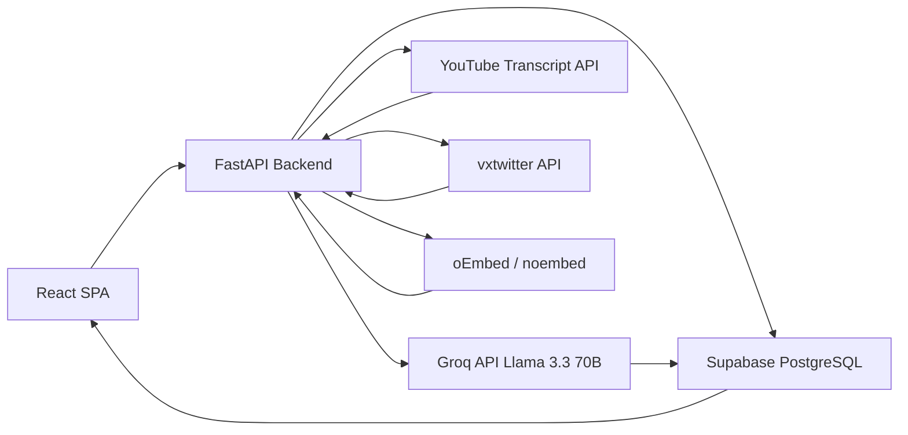
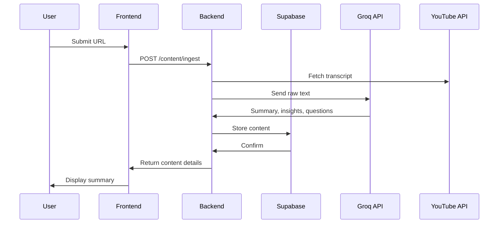

# Recall

A personal knowledge management system that transforms online content into retained, queryable knowledge. Paste a YouTube video, article, or X/Twitter link — Recall extracts the content, generates summaries and quiz questions, and lets you search and chat with everything you've saved.

**[Try it live →](https://recall-eight-self.vercel.app/)**

## Problem Statement

Most content consumed online — YouTube videos, articles, social threads — is forgotten within days. Existing tools like Pocket or Instapaper provide passive saving without structured review. Spaced repetition systems exist but require manually entering content. Recall automates the ingestion pipeline and ties AI-generated quizzes directly to source material, turning passive consumption into active retention.

## System Overview

Users submit URLs via the frontend. The backend scraper detects content type and applies appropriate extraction logic: YouTube transcripts via `youtube-transcript-api`, article HTML via BeautifulSoup, tweets via vxtwitter API. Extracted text is sent to Groq's API (Llama 3.3 70B) which generates a 3-sentence summary, 5 key insights, 6 multiple-choice quiz questions with distractors, and a genre classification. All data persists in Supabase (PostgreSQL) with Row-Level Security. Users can quiz themselves, take markdown notes, highlight text, export to PDF, or chat with saved content via streaming responses.

## Architecture



## Data Flow



## Technical Stack

| Layer | Technology | Rationale |
|---|---|---|
| Frontend | React 18 + Vite | Component-based, fast builds |
| Routing | React Router 6 | SPA navigation |
| Charts | Recharts | Lightweight, composable |
| Backend | FastAPI + Uvicorn | Async, automatic OpenAPI docs |
| Database | Supabase PostgreSQL | RLS for per-user data isolation |
| AI | Groq API (Llama 3.3 70B) | Fast inference, large context window |
| Scraping | youtube-transcript-api | Direct transcript extraction |
| PDF | fpdf2 | Pure Python, no binary dependencies |

## Key Engineering Features

**Content-type routing:** The scraper detects URL type (YouTube, article, Twitter) and applies the appropriate extraction strategy. YouTube falls back through multiple transcript providers. Articles fall back to `og:description`. Tweets fall back to HTML extraction if vxtwitter fails. No single provider failure breaks the ingestion pipeline.

**Streaming chat responses:** Chat uses Server-Sent Events (SSE) for token-by-token streaming from Groq. The frontend renders tokens as they arrive via `EventSource`, avoiding the perception of blocking on long responses.

**Row-Level Security:** All Supabase tables use RLS policies — users can only query their own data. JWT tokens are validated server-side on every request. Foreign key relationships are enforced at the database level.

**Full-text search:** PostgreSQL full-text search indexes via migration add `search_vector` columns using `to_tsvector`. Search uses `to_tsquery` for sub-100ms response times across large libraries, replacing slow `ILIKE` queries.

## AI Integration

Model: Llama 3.3 70B via Groq API (cloud inference).

Tasks: summarization (3-sentence constraint), key insight extraction (5 items), quiz question generation (6 MCQ with 3 distractors each), and genre classification.

System prompts include raw content and enforce JSON output schemas. Responses are validated with Pydantic models before storage. Invalid or malformed responses trigger regeneration with error context appended to the prompt.

## Installation & Setup

**Prerequisites**
- Python 3.11+
- Node.js 18+
- Supabase project (free tier works)
- Groq API key ([console.groq.com](https://console.groq.com))

**Backend**
```bash
cd backend
python -m venv venv
venv\Scripts\activate   # Windows
# source venv/bin/activate  # Mac/Linux
pip install -r requirements.txt
```

Create `.env` in `backend/`:
SUPABASE_URL=https://your-project.supabase.co
SUPABASE_KEY=your-anon-key
JWT_SECRET=your-jwt-secret
GROQ_API_KEY=your-groq-key
FRONTEND_URL=http://localhost:3000

Run migrations in Supabase SQL Editor using migration files in `backend/`.

```bash
python -m uvicorn main:app --reload --port 8000
```

**Frontend**
```bash
cd frontend
npm install
npm run dev
```

**Both at once**
```bash
python run.py
```

## Project Structure
```
recall/
├── backend/
│   ├── core/
│   │   ├── ai.py           # Groq API client, prompt templates
│   │   ├── scraper.py      # YouTube, article, Twitter scrapers
│   │   ├── pdf_export.py   # PDF generation with fpdf2
│   │   ├── supabase.py     # Database client
│   │   └── security.py     # JWT bearer validation
│   ├── routers/
│   │   ├── auth.py         # Register, login, onboarding
│   │   ├── ingest.py       # Content ingestion, chat, highlights
│   │   ├── notes.py        # CRUD for notes
│   │   └── review.py       # Dashboard, library, quiz, search
│   ├── schemas/
│   │   └── schemas.py      # Pydantic request/response models
│   └── main.py             # FastAPI entry point
├── frontend/
│   └── src/
│       ├── api/client.js   # Fetch wrapper with JWT injection
│       ├── components/     # Layout, ChatPanel, IngestModal, etc.
│       └── pages/          # Dashboard, Library, Quiz, Notes, Highlights
├── railway.toml            # Railway deployment config
├── vercel.json             # Vercel SPA routing config
└── run.py                  # Concurrent launcher for backend + frontend
```

## Technical Challenges & Solutions

**YouTube transcript availability:** Videos with disabled captions, age restrictions, or unsupported languages fail transcript extraction. Built a multi-tier fallback: primary transcript API, secondary HTML scraping, manual paste as final fallback. The system never hangs — every failure path has a user-facing resolution.

**Twitter/X scraping fragility:** vxtwitter endpoints change and rate-limit without warning. Implemented graceful degradation to `og:description` extraction from the tweet's HTML. If that also fails, the user is prompted to provide context manually.

**Full-text search at scale:** `ILIKE` queries become slow as libraries grow. Added PostgreSQL FTS indexes via migration — `to_tsvector` on title and content columns, queried with `to_tsquery`. Search now handles large libraries with sub-100ms response times.

**Streaming with FastAPI:** SSE streaming from Groq must integrate with FastAPI's async request handling. Used `StreamingResponse` with an async generator that yields tokens as they arrive from the Groq streaming endpoint. The frontend `EventSource` handles reconnection automatically.

## Known Limitations

- No offline content access: content and AI responses require network connectivity
- Quiz questions are static: no difficulty adjustment based on user performance history
- PDF export does not preserve original formatting or embedded media
- No collaborative features: data is isolated per user; sharing requires re-ingestion

## Future Improvements

- Offline-first: cache content in IndexedDB, sync on reconnect
- Anki export: export highlighted passages as spaced repetition decks
- Audio summaries: text-to-speech for summaries during commutes
- Additional source types: podcast RSS feeds, PDF uploads

## Lessons Learned

- Content scraping is inherently fragile — abstraction layers must be built from the start, not retrofitted when providers change
- Structured AI output requires explicit JSON schema constraints and validation; prompt deviations are common enough that regeneration logic is necessary, not optional
- RLS policies in Supabase provide strong security guarantees but require careful query construction — database views that encapsulate RLS logic simplify common access patterns

## License

MIT
